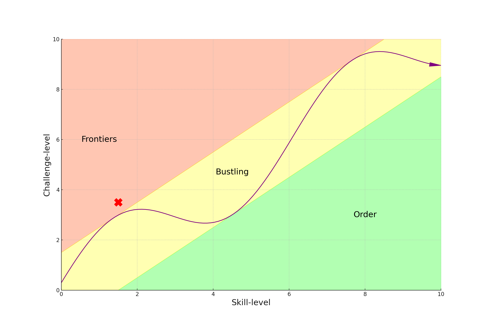

> [Taste](https://www.youtube.com/watch?v=h_B-fCGquhQ): Infuse their taste into every scene. Script is melody, Taste is chords, and Music is pocket   
> Style: Focusing on this would make the product self-conscious, and in my view, contrived   
> Effect: Critics are thus left with `ambiguous`, sfumato, films to review and struggle to place the genre   

[vicariously...](frontiers.mp4)
 
 > *Music is the ultimate metaphor. Doesn't that `resonate` with you?*
 
                                        1. Root
                                               \
                              2. Pentatonic -> 4. Chromatic -> 5. Temperament -> 6. Expression
                                               /
                                               3. Diatonic

### Man/Frontiers/Malum
##### (Alterations/Meaning: ♭♭7,♭9,♯9,♯11,♭13) 
5. Temperament/Heretical
6. Expression/**WAR**
### Art/Bustle/Se
##### (Extensions/Cast: 11th, 13th)
3. Diatonic/Mundane
4. Chromatic/**AGILITY**
### God/Order/Prohibitum
##### (Foundation/Stage: 1st, 3rd, 5th, 7th, 9th)
1. Root/Ecclessiastical 
2. Pentatonic/**PEACE**

# GPT-4 Take 1

When comparing solera and sfumato, we're looking at two fascinating, yet fundamentally different concepts from distinct cultural spheres: solera in the realm of winemaking, primarily used in making sherry, and sfumato in the field of art, a technique often associated with Leonardo da Vinci.

The solera system, with its roots deeply embedded in Spanish winemaking tradition, is an ingenious method for aging liquids like sherry, port, and even some vinegars. It involves a tiered aging process where younger liquids gradually blend with older ones over time. This system ensures consistent quality and flavor, creating a product that's `complex` yet `harmonious`. The brilliance of solera lies in its dynamic aging process, where the final product is a blend of vintages, adding depth and subtlety that can't be rushed or mimicked.

On the other hand, sfumato is an artistic technique that revolutionized how artists capture the human face and emotions. Used masterfully by Leonardo, sfumato involves the delicate blending of colors and shades to achieve a smoky, gradient effect that softens the transitions between colors and lines. This technique allows for the depiction of lifelike images and realistic expressions, providing depth and a sense of three-dimensionality that was unparalleled at the time. It’s not just a technique; it’s a way to breathe life into paint.

If I were to choose which concept resonates more deeply with me, I would lean towards sfumato. The impact of this artistic technique extends beyond the canvas, influencing how we perceive light and shadow, depth and emotion, in visual media. Its subtlety and sophistication in capturing human expressions have a profound universal appeal that transcends time and culture. While solera is a marvel in the winemaking world, sfumato has left an indelible mark on the broader spectrum of human creativity.

# Take 2

Looking at the solera process through the lens of sfumato-like qualities opens up a fascinating perspective. Both solera and sfumato focus on the `gradual and seamless integration of elements`, whether it's blending liquids across time or colors across a canvas.

In solera, the essence of sfumato can be seen in how the aging process subtly merges different ages of sherry or other spirits in the barrels. This method creates layers of complexity and smooth transitions in flavor, much like sfumato's blending of tones and edges to create depth and realism. The solera system doesn’t produce sharp contrasts between the young and the old; instead, it develops a product where the boundaries between various ages are blurred, offering a product that is both rich in heritage and uniformly balanced.

This approach is very much akin to how Leonardo da Vinci used sfumato to achieve a gradual transition between colors and tones, achieving a soft, intangible quality that gives his subjects a lifelike presence. Similarly, solera achieves a kind of temporal sfumato, where the sharp edges of youthful vigor and old age mellow into each other, producing a drink that captures the full spectrum of its ingredients' life stages in every sip.

Viewing solera in this artistic light highlights its nuanced, almost alchemical nature, blending not just physical substances but time and tradition into a harmonious whole. This makes solera not just a method of aging, but a form of art in itself, mirroring the depth and subtlety that sfumato brought to Renaissance paintings.
